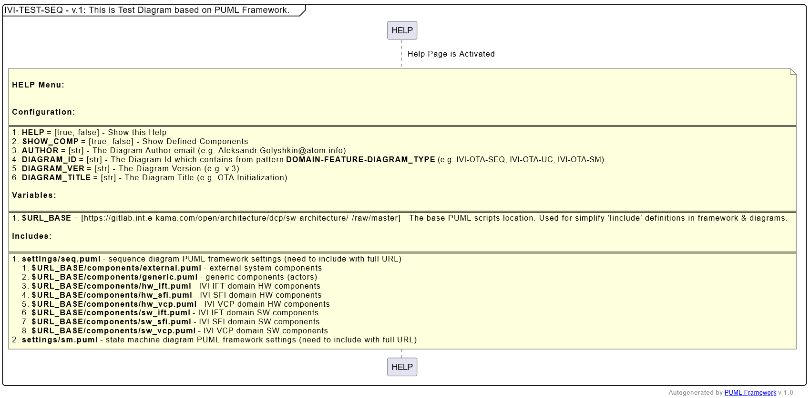
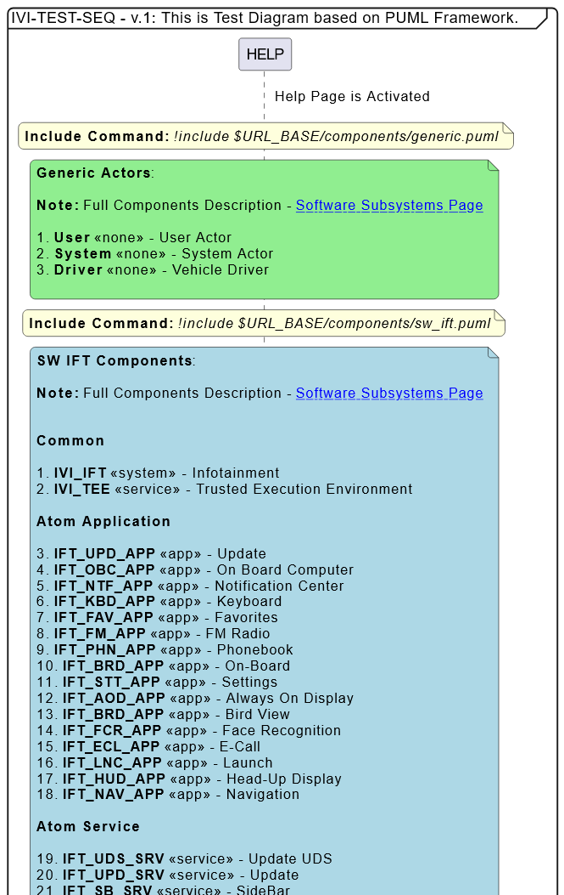
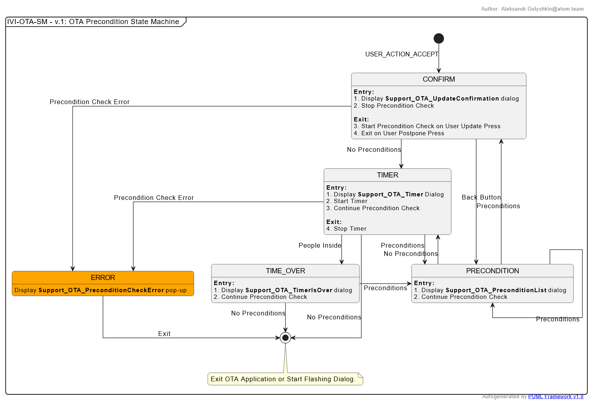
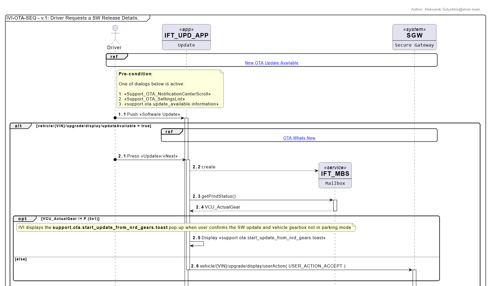

# puml_framework

# Help Example
```puml
@startuml

!$CONFIG = {
"HELP": true,
"SHOW_COMP": false,
"AUTHOR": "Alexandr.Golyshkin@atom.team",
"DIAGRAM_ID": "IVI-TEST-SEQ",
"DIAGRAM_VER": "v.1",
"DIAGRAM_TITLE": "This is Test Diagram based on PUML Framework."
}

!include https://raw.githubusercontent.com/golyshkin/puml_framework/refs/heads/main/settings/seq.puml
!include $URL_BASE/components/generic.puml
!include $URL_BASE/components/hw_ift.puml
!include $URL_BASE/components/hw_sfi.puml
!include $URL_BASE/components/hw_vcp.puml
!include $URL_BASE/components/sw_ift.puml
!include $URL_BASE/components/sw_sfi.puml
!include $URL_BASE/components/sw_vcp.puml

@enduml
```
# Help Output


# Components Help Example

```puml
@startuml

!$CONFIG = {
"HELP": false,
"SHOW_COMP": true,
"AUTHOR": "Alexandr.Golyshkin@atom.team",
"DIAGRAM_ID": "IVI-TEST-SEQ",
"DIAGRAM_VER": "v.1",
"DIAGRAM_TITLE": "This is Test Diagram based on PUML Framework."
}


' Date 10.04.2026
!include https://gitlab.int.e-kama.com/open/architecture/dcp/sw-architecture/-/raw/master/settings/seq.puml

!include $URL_BASE/components/generic.puml
'!include $URL_BASE/components/hw_ift.puml
'!include $URL_BASE/components/hw_sfi.puml
'!include $URL_BASE/components/hw_vcp.puml
!include $URL_BASE/components/sw_ift.puml
!include $URL_BASE/components/sw_sfi.puml
'!include $URL_BASE/components/sw_vcp.puml

@enduml
```
# Components Help Output


# Diagram Example based on PUML Framework
## State Diagram
```puml
@startuml
!$CONFIG = {
"HELP": false,
"SHOW_COMP": false,
"AUTHOR": "Aleksandr.Golyshkin@atom.team",
"DIAGRAM_ID": "IVI-OTA-SM",
"DIAGRAM_VER": "v.1",
"DIAGRAM_TITLE": "OTA Precondition State Machine"
}

' Date 10.04.2026
!include https://gitlab.int.e-kama.com/open/architecture/dcp/sw-architecture/-/raw/master/settings/sm.puml

state ERROR #orange
state END <<end>>

CONFIRM: **Entry:**
CONFIRM: # Display **Support_OTA_UpdateConfirmation** dialog
CONFIRM: # Stop Precondition Check
CONFIRM:
CONFIRM: **Exit:**
CONFIRM: # Start Precondition Check on User Update Press
CONFIRM: # Exit on User Postpone Press

PRECONDITION: **Entry:**
PRECONDITION: # Display **Support_OTA_PreconditionList** dialog
PRECONDITION: # Continue Precondition Check

TIMER: **Entry:**
TIMER: # Display **Support_OTA_Timer** Dialog
TIMER: # Start Timer
TIMER: # Continue Precondition Check
TIMER: 
TIMER: **Exit:**
TIMER: # Stop Timer

TIME_OVER: **Entry:**
TIME_OVER: # Display **Support_OTA_TimerIsOver** dialog
TIME_OVER: # Continue Precondition Check

ERROR: Display **Support_OTA_PreconditionCheckError** pop-up

[*] -down-> CONFIRM : USER_ACTION_ACCEPT
CONFIRM --> TIMER: No Preconditions
CONFIRM --> PRECONDITION: Preconditions
CONFIRM -> ERROR: Precondition Check Error

PRECONDITION --> CONFIRM : Back Button
PRECONDITION --> PRECONDITION : Preconditions
PRECONDITION --> TIMER : No Preconditions

TIMER --> TIME_OVER: People Inside
TIMER -> PRECONDITION: Preconditions
TIMER --> ERROR: Precondition Check Error
TIMER -> END: No Preconditions

TIME_OVER -> PRECONDITION: Preconditions
TIME_OVER --> END: No Preconditions

ERROR -> END: Exit
note bottom of END: Exit OTA Application or Start Flashing Dialog.
@enduml
```
## State Diagram Output


## Sequence Diagram
```puml
@startuml

!$CONFIG = {
"HELP": false,
"AUTHOR": "Aleksandr.Golyshkin@atom.team",
"DIAGRAM_ID": "IVI-OTA-SEQ",
"DIAGRAM_VER": "v.1",
"DIAGRAM_TITLE": "Driver Requests a SW Release Details."
}

!include https://gitlab.int.e-kama.com/open/architecture/dcp/sw-architecture/-/raw/master/settings/seq.puml
!include $URL_BASE/components/generic.puml
!include $URL_BASE/components/sw_ift.puml
!include $URL_BASE/components/external.puml

ref over Driver, SGW: [["#IVIOTAArchitecture-NewOTAUpdateAvailable" New OTA Update Available]]

note right of Driver
**Pre-condition**:
\t
One of dialogs below is active:
\t
# <<Support_OTA_NotificationCenterScroll>>
# <<Support_OTA_SettingsList>>
# <<support.ota.update_available.information>>
end note

Driver o-> IFT_UPD_APP ++ : Push <<Software Update>>
alt vehicle/{VIN}/upgrade/display/updateAvailable = true
ref over IFT_UPD_APP, SGW: [["#IVIOTAArchitecture-OTAWhatsNew" OTA Whats New]]

autonumber 2.1 "#.#"
|||
Driver o-> IFT_UPD_APP ++: Press <<Update>>/<<Next>>
IFT_UPD_APP --> IFT_MBS **: create
IFT_UPD_APP -> IFT_MBS ++: getPrndStatus()
IFT_MBS --> IFT_UPD_APP --: VCU_ActualGear
opt VCU_ActualGear != P (0x1)
note over IFT_UPD_APP: IVI displays the **support.ota.start_update_from_nrd_gears.toast** pop-up when user confirms the SW update and vehicle gearbox not in parking mode
IFT_UPD_APP -> IFT_UPD_APP : Display <<support.ota.start_update_from_nrd_gears.toast>>
|||
else else
IFT_UPD_APP -> SGW --++: vehicle/{VIN}/upgrade/display/userAction( USER_ACTION_ACCEPT )
|||
end opt

SGW -> SGW: onUserUpdateNext()
SGW -> IFT_UPD_APP ++: vehicle/{VIN}/upgrade/display/updateConfirmation( leaveVehicleMin, updateEstimateTotalMin )
IFT_UPD_APP -> IFT_UPD_APP : Display <<Support_OTA_UpdateConfirmation>>
|||
else else
note across
Actually OTA was completed, but old OTA notifications are still available for user.
end note
IFT_UPD_APP -> SGW ++ : vehicle/{VIN}/upgrade/display/currentVersion
return vehicle/{VIN}/upgrade/display/currentVersion( vehicleSwVersion )
IFT_UPD_APP -> IFT_UPD_APP --: Display <<Support_OTA_UpdateNotRequired>>
|||
end alt
@enduml
```

## Sequence Diagram Output

