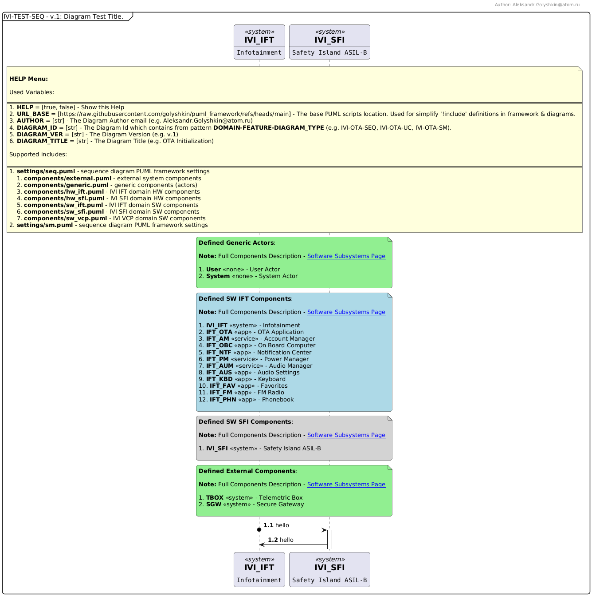

# puml_framework

# Usage Example
```
@startuml

!$CONFIG = {
   "HELP": true,
   "AUTHOR": "Alexandr.Golyshkin@ya.ru",
   "DIAGRAM_ID": "IVI-TEST-SEQ",
   "DIAGRAM_VER": "v.1",
   "DIAGRAM_TITLE": "This is Test Diagram based on PUML Framework."
}

!include https://raw.githubusercontent.com/golyshkin/puml_framework/refs/heads/main/settings/seq.puml
!include $URL_BASE/components/generic.puml
!include $URL_BASE/components/sw_ift.puml
!include $URL_BASE/components/sw_sfi.puml
!include $URL_BASE/components/external.puml

IVI_IFT o-> IVI_SFI ++: hello Test2
IVI_SFI -> IVI_IFT: hello

@enduml
```
# Output

